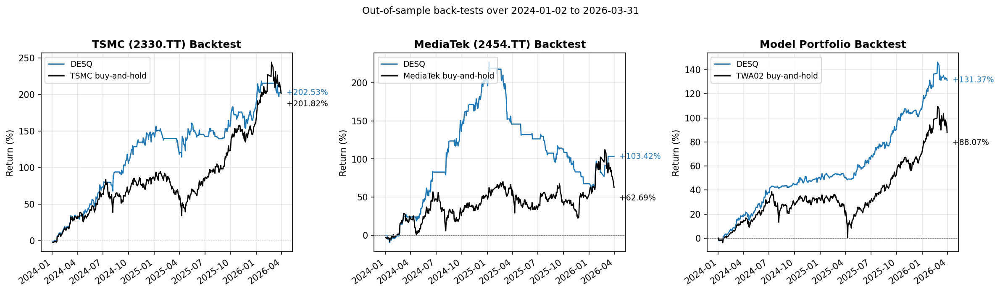
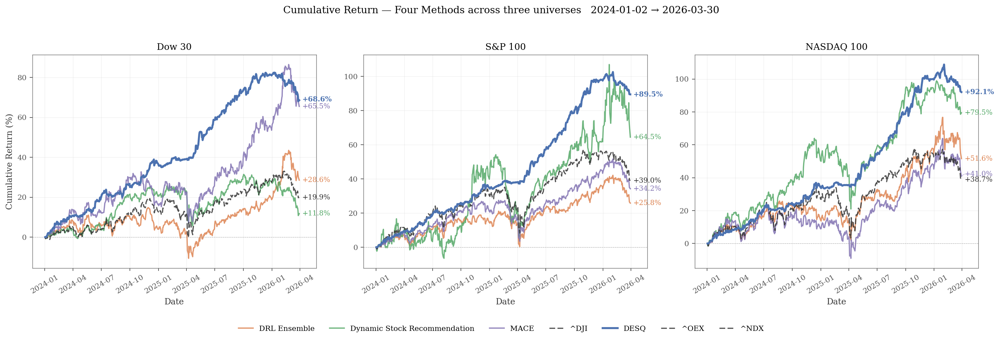

# TW-50 Attention + Flooding + DES Pipeline

A market-timing framework for the TWSE Top-50 constituents that stacks:

1. **Attention (ATT) sequence classifier** with static Flooding regularization (Bayesian hyperparameter search).
2. **Dynamic Flooding** retraining with the best `flooding_b` per aspect.
3. **Dynamic Ensemble Selection (KNORA-E)** across the 5 per-aspect ATT predictions, followed by a signal-pattern-driven backtest.

The pipeline uses **walk-forward rolling validation** (4:1 train:val ratio) on 5 feature aspects (no sentiment, no CUSUM).

## Experimental results

Out-of-sample back-tests over the 2024-01-02 to 2026-03-31 test window. DESQ (blue) is the KNORA-E ensemble of the five ATT+Dynamic-Flooding aspects with the signal-pattern trader; the black line is a passive buy-and-hold benchmark.



| Panel | DESQ cumulative return | Buy-and-hold cumulative return | Source CSV |
| --- | ---: | ---: | --- |
| TSMC (2330.TT) | **+202.53 %** | +201.82 % | [evaluation/backtest_2330.csv](evaluation/backtest_2330.csv) |
| MediaTek (2454.TT) | **+103.42 %** | +62.69 % | [evaluation/backtest_2454.csv](evaluation/backtest_2454.csv) |
| TW-50 Model Portfolio (vs TWA02) | **+131.37 %** | +88.07 % | [evaluation/backtest_portfolio_tw50.csv](evaluation/backtest_portfolio_tw50.csv) |

Regenerate the figure directly from the shipped CSVs with:

```bash
python evaluation/render_figure_backtest.py
```

The CSV schemas are:

- Single-stock panels (`backtest_2330.csv`, `backtest_2454.csv`): `Date, Model_Return_Pct, Stock_Return_Pct, Model_Return_Ratio, Stock_Return_Ratio`.
- Portfolio panel (`backtest_portfolio_tw50.csv`): `Date, Model_CumRet, Benchmark_CumRet, Model_CumRet_Pct, Benchmark_CumRet_Pct`.

### US extension ??four-method paper reproduction

Same ATT + Dynamic Flooding + KNORA-E stack applied to Dow 30 / S&P 100 / NASDAQ 100, benchmarked against three published DRL baselines. **DESQ** = our method (blue). See the [US extension README](us/README.md) and [baselines/backtest_report.md](us/baselines/backtest_report.md) for full experimental setup.



| Universe | DESQ (ours) | DSR ??Yang 2018 | DRL Ensemble ??Yang 2020 | MACE ??Abbade 2026 | Benchmark index |
| --- | ---: | ---: | ---: | ---: | ---: |
| Dow 30     | **+68.6 %** | +11.8 % | +28.6 % | +65.5 % | +19.9 % (^DJI) |
| S&P 100    | **+89.5 %** | +64.5 % | +25.8 % | +34.3 % | +39.0 % (^OEX) |
| NASDAQ 100 | **+92.1 %** | +79.5 % | +51.6 % | +41.0 % | +38.7 % (^NDX) |

Per-day cumulative-return CSVs (columns: `date, DESQ, DRL Ensemble, Dynamic Stock Recommendation, MACE, <benchmark>`):

- [us/baselines/combined/dow30_comparison.csv](us/baselines/combined/dow30_comparison.csv)
- [us/baselines/combined/sp100_comparison.csv](us/baselines/combined/sp100_comparison.csv)
- [us/baselines/combined/ndx100_comparison.csv](us/baselines/combined/ndx100_comparison.csv)

Full stats (Sharpe / Sortino / MaxDD / Calmar): [us/baselines/combined/combined_stats.md](us/baselines/combined/combined_stats.md) · [combined_stats.csv](us/baselines/combined/combined_stats.csv). Regenerate the figure with `python us/baselines/combined/combined_comparison.py`.

### Training time (single stock)

Measured on RTX 5090 and RTX 5080 (WSL2 Ubuntu-24.04, TF 2.21, `finlab` conda env). Wall-clock time is essentially the same on both cards for this workload.

| Stage | Script | Time per stock |
| --- | --- | ---: |
| Phase 1 ??hyperparameter search (Bayesian) | `ATT+Flood.py` | ~3 h |
| Phase 2 ??Dynamic Flooding retraining (18 repeats, top-3 kept) | `ATT+Dflooding.py` | ~2 h |
| DES ensemble (RF + KNORA-E + CUSUM + backtest) | `DES_update_ATT-sentiment.py` | ~5 min |
| **Total per stock** (6 aspects, ATT only) | Batch_training agent | **~5 h** |

Reference guides for the internal end-to-end training pipeline that produced the above experimental results (uses the parent workspace's ATT scripts, not the compact `tw50_flood.py` / `tw50_dflood.py` / `tw50_des.py` demos in this repo):

- [docs/att_batch_training/README_Batch_training.md](docs/att_batch_training/README_Batch_training.md) ??Batch_training agent (RTX 5090)
- [docs/att_batch_training/README_Batch_training_5080.md](docs/att_batch_training/README_Batch_training_5080.md) ??Batch_training agent (RTX 5080)
- [docs/att_batch_training/README_DES.md](docs/att_batch_training/README_DES.md) ??DES ensemble execution guide

## Data window

| Split                | Range                        |
| -------------------- | ---------------------------- |
| ATT training         | 2010-01-01 ~ **2023-12-31**  |
| DES (KNORA-E) train  | 2020-01-01 ~ **2023-12-31**  |
| Test (held-out)      | 2024-01-01 ~ **2026-03-31**  |
| Validation           | last 20% of the train window (rolling, 5 folds) |

## Feature aspects (5)

`fundamental`, `trade`, `tech_trend`, `moment`, `macro`.

Each CSV under `features/` follows the layout `<aspect>_<stock_id>.csv`, with the last 4 columns being labels `y_10, y_20, y_40, y_60`.

## Universe

TWSE Top-50 constituents by market cap on 2023-12-29 ??see [tw50_top50.csv](tw50_top50.csv).

## Pipeline

```
                    ?Œâ??€?€?€?€?€?€?€?€?€?€?€?€?€?€?€?€??
features (5 aspects)?? tw50_flood.py  ?? Bayesian tuning over ATT hyperparams
                    ??  (Stage 1)     ?? + static Flooding grid b in {0.00..0.40}
                    ?”â??€?€?€?€?€?€?€?¬â??€?€?€?€?€?€?€?? Saves best trial per (stock, aspect)
                             ??
                    ?Œâ??€?€?€?€?€?€?€?€?€?€?€?€?€?€?€?€??
                    ??tw50_dflood.py  ?? Fixed-HP retraining + Dynamic Flooding
                    ??  (Stage 2)     ?? Emits DES-train (in-sample 2020..2023)
                    ?”â??€?€?€?€?€?€?€?¬â??€?€?€?€?€?€?€?? + test (OOS 2024..2026) probabilities
                             ??
                    ?Œâ??€?€?€?€?€?€?€?€?€?€?€?€?€?€?€?€??
                    ?? tw50_des.py    ?? KNORA-E over 5 ATT probabilities +
                    ??  (Stage 3)     ?? signal-pattern-driven backtest
                    ?”â??€?€?€?€?€?€?€?€?€?€?€?€?€?€?€?€?? Reports cum_model vs buy&hold
```

## Repository layout

```
tw50_pipeline/
?œâ??€ README.md
?œâ??€ LICENSE
?œâ??€ requirements.txt
?œâ??€ .gitignore
?œâ??€ tw50_top50.csv               # 50 stock IDs + market cap weights
?œâ??€ features/                    # 5 aspects x 50 stocks = 250 CSVs
??  ?œâ??€ fundamental_<id>.csv
??  ?œâ??€ trade_<id>.csv
??  ?œâ??€ tech_trend_<id>.csv
??  ?œâ??€ moment_<id>.csv
??  ?”â??€ macro_<id>.csv
?œâ??€ prices/                      # user-supplied OHLCV per stock (git-ignored)
??  ?”â??€ <id>.csv                 # populated by fetch_prices.py
?œâ??€ fetch_prices.py              # yfinance -> prices/<id>.csv helper
?œâ??€ tw50_flood.py                # Stage 1: hyperparameter + flooding-b search
?œâ??€ tw50_dflood.py               # Stage 2: Dynamic Flooding retrain + predict
?œâ??€ tw50_des.py                  # Stage 3: KNORA-E ensemble + backtest
?œâ??€ artifacts/                   # generated at runtime (git-ignored)
??  ?œâ??€ flood/{hyperbayes,feature_selection,feature_scaler,experiments}/
??  ?œâ??€ dflood/{feature_selection,feature_scaler,models,pred}/
??  ?”â??€ des/{pred,models,backtest}/
?œâ??€ evaluation/                  # shipped back-test CSVs + figure regen script
?”â??€ dqn/                         # optional DQN benchmark using DES output
```

## Install

Python 3.11 (tested), 3.10 also works.

```powershell
# Windows PowerShell
python -m venv .venv
.\.venv\Scripts\Activate.ps1
python -m pip install --upgrade pip
pip install -r requirements.txt
```

```bash
# Linux / WSL / macOS
python -m venv .venv
source .venv/bin/activate
python -m pip install --upgrade pip
pip install -r requirements.txt
```

If you want the price fetcher (Stage 3 backtest), install `yfinance` in addition:

```powershell
pip install yfinance
```

TensorFlow 2.21 uses the GPU on Linux/WSL if CUDA is available; on Windows it will fall back to CPU (which is fine for smoke testing).

## Quick start ??end-to-end smoke test (one stock, ~5 minutes on CPU)

The commands below reproduce the smoke test that was executed on 2026-07-30 in this repo. Elapsed times were measured on Windows / CPU-only TF 2.21.

```powershell
# 0. Fetch OHLCV for 2330 (needed by Stage 3 backtest).
python fetch_prices.py --stock-ids 2330

# 1. Stage 1 ??Bayesian tuning + static Flooding (all 5 aspects, ~4 min).
python tw50_flood.py --stock-ids 2330 --aspect all --trials 2 --epochs 3 --batch-size 128

# 2. Stage 2 ??Dynamic Flooding retrain + predict (~30 s).
python tw50_dflood.py --stock-ids 2330 --aspect all --epochs 5 --batch-size 128

# 3. Stage 3 ??KNORA-E ensemble + backtest (~12 s).
python tw50_des.py --stock-ids 2330 --no-show
```

**Expected smoke-test output (Stage 3 tail):**

```text
=== DES: 2330 ===
[2330] fitting RandomForest ...
[2330] fitting KNORA-E ...
[2330] cum_model=0.217, cum_stock=2.002, excess=-1.785, buys=18, sells=18
[SUMMARY] 1 rows -> artifacts/des/backtest/summary.csv
```

`cum_model=0.217` means +21.7% cumulative return over the test window with only 2 tuner trials and 3-epoch ATT models ??this is a **plumbing smoke test**, not a production result. See "Production settings" below for realistic numbers.

## Full run ??one stock (production settings)

Uses the tuner budget the code was designed for.

```powershell
python fetch_prices.py --stock-ids 2330

python tw50_flood.py  --stock-ids 2330 --aspect all --trials 12 --epochs 80
python tw50_dflood.py --stock-ids 2330 --aspect all --epochs 120
python tw50_des.py    --stock-ids 2330 --no-show
```

Expected wall time on a mid-range GPU (Linux/WSL, TF 2.21 with CUDA): roughly 20 minutes per stock end-to-end. On Windows CPU it is much slower ??prefer WSL for full runs.

## Batch ??full TW-50

```powershell
# Fetch all 50 tickers up front (yfinance can throttle; --sleep controls pacing).
python fetch_prices.py --top50 --sleep 0.4

python tw50_flood.py  --top50 --aspect all
python tw50_dflood.py --top50 --aspect all
python tw50_des.py    --top50 --no-show
```

Results land in `artifacts/des/backtest/summary.csv`, one row per stock.

## Preflight checklist

Run these once before your first batch to make sure your environment is ready:

```powershell
# 1. Deps import
python -c "import tensorflow as tf, keras_tuner, deslib, sklearn, joblib; print('tf', tf.__version__, 'sklearn', sklearn.__version__, 'deslib', deslib.__version__)"

# 2. GPU visible (Linux/WSL only; expect an empty list on Windows).
python -c "import tensorflow as tf; print(tf.config.list_physical_devices('GPU'))"

# 3. Features present.
python -c "from pathlib import Path; n = len(list(Path('features').glob('*.csv'))); print(f'features: {n} CSVs')"

# 4. Prices present for stocks you plan to backtest.
python -c "from pathlib import Path; ids = ['2330','2454']; missing = [s for s in ids if not (Path('prices')/f'{s}.csv').exists()]; print('missing prices:', missing)"
```

## Notes and caveats

- **Prices are user-supplied.** `tw50_des.py` reads `prices/<stock_id>.csv` with columns `Date,Open,High,Low,Close,Volume`. Use `fetch_prices.py` (yfinance) or bring your own source. Without a price CSV, Stage 3 still saves the DES/RF probability files but skips the backtest.
- **Walk-forward rolling constants**: `WF_N_SPLITS=5`, `WF_VAL_RATIO=0.2`, `WF_GAP=10` trading days between train and validation to reduce leakage.
- **Stage 2 emits both train and test predictions.** The DES-train window (2020-01-01..2023-12-31) predictions are *in-sample* w.r.t. the ATT trained on 2010-2023; they exist so that Stage 3's KNORA-E has enough labeled samples to fit. The reported backtest metrics (`cum_model`, `excess_ret`) still come from the fully out-of-sample test window 2024-01-01..2026-03-31.
- **deslib 0.3.7 + scikit-learn 1.7 compat.** `tw50_des.py` monkey-patches `BaseEstimator._validate_data` so deslib's `KNORAE.fit(...)` keeps working. Nothing else in your environment is affected.
- **Environment override variables** (all optional):
  - `FEATURE_ROOT` ??where to look for `<aspect>_<id>.csv` (default: `./features`).
  - `MODEL_ROOT` ??where Stage 1 stores tuning artifacts (default: `./artifacts/flood`).
  - `DFLOOD_ROOT` ??where Stage 2 stores retrained model + preds (default: `./artifacts/dflood`).
  - `DES_ROOT` ??where Stage 3 stores KNORA-E artifacts (default: `./artifacts/des`).
  - `PRICES_DIR` ??where Stage 3 reads OHLCV (default: `./prices`).

## Troubleshooting

| Symptom                                                              | Fix                                                                                                              |
| -------------------------------------------------------------------- | ---------------------------------------------------------------------------------------------------------------- |
| `ModuleNotFoundError: tensorflow` / `keras_tuner` / `deslib`         | `pip install -r requirements.txt` in the active venv.                                                            |
| `AttributeError: 'KNORAE' object has no attribute '_validate_data'`  | Pull latest `tw50_des.py` ??it applies the deslib+sklearn-1.7 compat shim automatically.                         |
| Stage 3 fails with `DES train slice too short (0)`                   | Re-run Stage 2 with the current `tw50_dflood.py` (older versions only wrote the test window).                    |
| `[stock] no price CSV at prices/<id>.csv; skipping backtest`         | Run `python fetch_prices.py --stock-ids <id>`.                                                                   |
| yfinance returns EMPTY for a ticker                                  | The Yahoo symbol is `<id>.TW`. Delisted or newly listed stocks may lack coverage; check on finance.yahoo.com.    |
| TF logs `Cannot dlopen some GPU libraries` in WSL                    | Export `LD_LIBRARY_PATH` to include the pip nvidia lib dirs before launching Python.                             |

## Optional ??DQN benchmark using DES output

The `dqn/` subfolder contains a Deep Q-Network trader adapted from `tunglich/Market-Timing-DQN`, using the DESQ pipeline output as the `<DES>` feature. See [dqn/README.md](dqn/README.md) for its own quick-start.

## License

MIT ??see [LICENSE](LICENSE).
