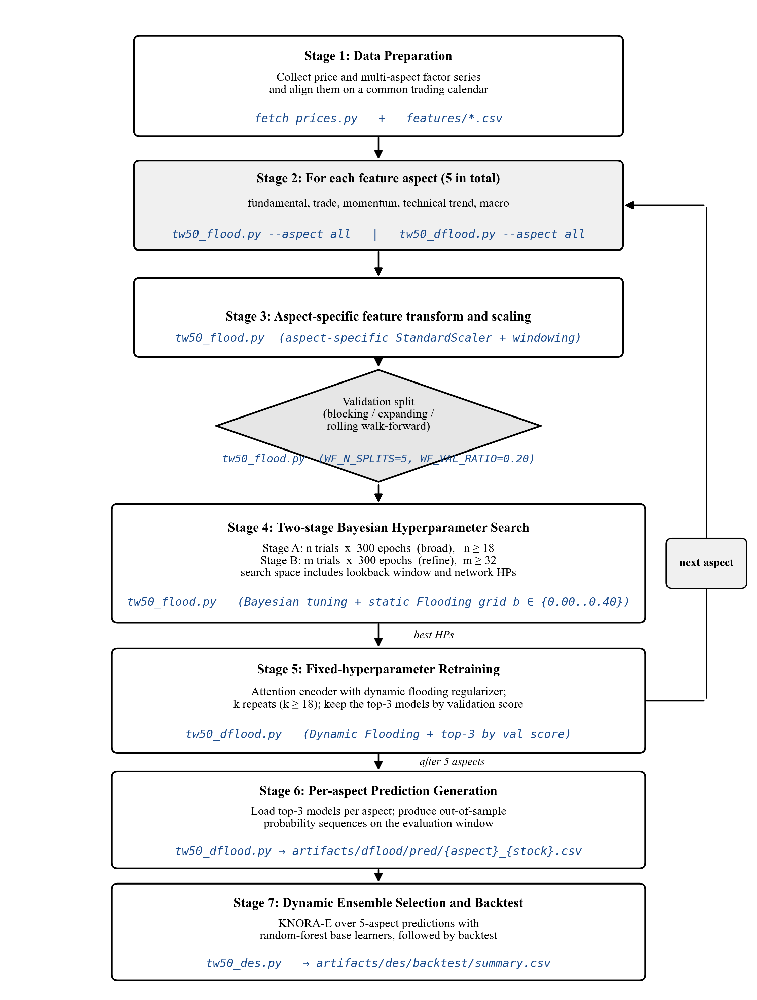

# TW-50 Attention + Flooding + DES Pipeline

[](https://github.com/tunglich/DESQ/actions/workflows/ci.yml)

A market-timing framework for the TWSE Top-50 constituents that stacks:

1. **Attention (ATT) sequence classifier** with static Flooding regularization (Bayesian hyperparameter search).
2. **Dynamic Flooding** retraining with the best `flooding_b` per aspect.
3. **Dynamic Ensemble Selection (KNORA-E, K=30)** across the 5 per-aspect ATT predictions.
4. **Signal-Conditioned Double DQN** using the DES signal, OHLC history, position state, and running P&L to choose `Skip / Buy / Close`.

The pipeline uses five **walk-forward rolling validation**
windows (4:1 train:validation ratio) with a 20-day label horizon and a further
30-trading-day purge on five feature aspects.

## End-to-end training pipeline

The seven stages below describe the end-to-end supervised training flow,
with repository script annotations added in blue. The `next aspect` loop
repeats stages 2–5 for each of the five feature aspects; after all five aspects
are trained, stages 6–7 run once. The separate Signal-Conditioned
Double DQN execution layer is documented under Stage 4 below.



Regenerate the figure with `python docs/_render_training_pipeline.py`.

## Self-improving monitoring protocol

The `monitoring` package implements the reference monitoring equations:
mature-label filtering, predictive/trading diagnostics, a five-alarm trigger over
two adjacent mature windows, immutable evaluations, and non-executing update
plans. A hypothetical localized Level-2 case is represented without claiming
that monitoring was active in the reported experiments. General Level
0-3 routing and numerical thresholds remain labeled repository operational
policy.

Start with `python -m monitoring smoke` and `python -m monitoring show-config`.
See [monitoring/README.md](monitoring/README.md) for metric APIs, diagnostic JSON
schemas, evaluation commands, and the deployment safety boundary.

## Experimental results

The current DRL evaluation uses exactly 520 common daily return observations
per curve. The shipped CSV curves reproduce the displayed endpoints; model
checkpoints remain in the development archive. See
[evaluation/drl_520/README.md](evaluation/drl_520/README.md) for the contract
and [evaluation/paper/README.md](evaluation/paper/README.md) for the remaining
reference-table evidence status.

| Evaluation result | DRL all_75 return | Benchmark return | Numerical source |
| --- | ---: | ---: | --- |
| TSMC (2330.TT) | **+232.93%** | +176.21% | [520-observation curve](evaluation/drl_520/2330_timeseries_75_65_60_55_vs_BH.csv) |
| MediaTek (2454.TT) | **+269.17%** | +65.76% | [520-observation curve](evaluation/drl_520/2454_timeseries_75_65_60_55_vs_BH.csv) |
| TWSE Top-50 portfolio | **+167.98%** | +94.76% | [520-observation curve](evaluation/drl_520/portfolio_market_timeseries_market_75_65_60_55_vs_TWA02.csv) |

### Evaluation result bundle

The repository publishes deterministic, machine-readable transcriptions and
audits for the reference evaluation tables:

| Evaluation artifact | Subject | Repository artifact |
| --- | --- | --- |
| Table 3 | Five walk-forward folds and sealed holdout precision | [table3_walk_forward.md](evaluation/paper/tables/table3_walk_forward.md) |
| Table 4 | Cumulative module ablation | [table4_module_ablation.md](evaluation/paper/tables/table4_module_ablation.md) |
| Table 5 | Signal-horizon sensitivity | [table5_horizon.md](evaluation/paper/tables/table5_horizon.md) |
| Table 6 | Dow 30, S&P 100, and NASDAQ 100 DDQN results | [table6_cross_market.md](evaluation/paper/tables/table6_cross_market.md) |
| Table 7 | Nine-seed uncertainty and statistical reliability | [table7_uncertainty.md](evaluation/paper/tables/table7_uncertainty.md) |
| Table 8 | Regime-conditional Top-50 performance | [table8_regime.md](evaluation/paper/tables/table8_regime.md) |
| Table A1 | Five-group, 78-feature taxonomy | [table9_feature_taxonomy.md](evaluation/paper/tables/table9_feature_taxonomy.md) |
| Table C1 | Per-stock Dynamic-Flooding ablation | [table10_top50_flooding.md](evaluation/paper/tables/table10_top50_flooding.md) |

Reference U.S. DDQN returns are **67.4%** for the Dow 30, **82.8%** for
the S&P 100, and **83.5%** for the NASDAQ 100. Complete annual return,
volatility, Sharpe, Sortino, drawdown, Calmar, benchmark, and peer-method
comparisons are in Table 6.

### Reference runtime

| Cost item | Scope | Approximate time |
| --- | --- | ---: |
| Supervised DESQ model building | One stock | ~4 h |
| Nine independent DDQN execution trials | One stock | ~15 h |
| Daily feature refresh | 500-stock pool | ~1.5 h |
| Daily inference, DES, and DDQN update | 500-stock pool | ~1.5 h |
| **Daily operation total** | **500-stock pool** | **~3 h** |

## Data window

| Split                | Range                        |
| -------------------- | ---------------------------- |
| ATT training         | 2010-01-01 ~ **2023-12-31**  |
| DES (KNORA-E) train  | 2020-01-01 ~ **2023-12-31**  |
| Test (held-out)      | 2024-01-01 ~ **2026-03-31**  |
| Validation           | last 20% of the train window (rolling, 5 folds) |

## Feature aspects (5)

The pipeline uses five attribute-grouped feature aspects. The display names differ slightly from the identifiers used in the code and on disk; the table below is the canonical mapping.

| Display name  | Code identifier | On-disk file pattern           | Description                                                        |
| ------------- | --------------- | ------------------------------ | ------------------------------------------------------------------ |
| Fundamental   | `fundamental`   | `features/fundamental_<id>.csv` | Valuation ratios, revenue / EPS / margin growth at MoM/QoQ/YoY.    |
| Float         | `trade`         | `features/trade_<id>.csv`       | Chip-flow / smart-money: foreign & institutional holdings, margin, short-balance, net-buy. |
| Price-Trend   | `tech_trend`    | `features/tech_trend_<id>.csv`  | Trend-following technicals: SMA/HullMA deviations, Aroon, MACD, Bollinger, OHLCV. |
| Momentum      | `moment`        | `features/moment_<id>.csv`      | Oscillator technicals: RSI, KD, Williams %R, CCI, ADX, acceleration, rolling beta. |
| Macro         | `macro`         | `features/macro_<id>.csv`       | Rates, commodities, global equity indices, VIX, FX, TAIEX futures/options. |

Each CSV follows the layout `<aspect>_<stock_id>.csv`, with the last 4 columns being labels `y_10, y_20, y_40, y_60`.

## Universe

TWSE Top-50 constituents by market cap on 2023-12-29 — see [tw50_top50.csv](tw50_top50.csv).

## Pipeline

```
                    ┌─────────────────┐
features (5 aspects)│  tw50_flood.py  │  Bayesian tuning over ATT hyperparams
                    │   (Stage 1)     │  + static Flooding grid b in {0.00..0.40}
                    └────────┬────────┘  Saves best trial per (stock, aspect)
                             ▼
                    ┌─────────────────┐
                    │ tw50_dflood.py  │  Fixed-HP retraining + Dynamic Flooding
                    │   (Stage 2)     │  Default: DES-train (in-sample 2020..2023)
                    │                 │  With --des-oof: DES-train is OOF from
                    │                 │  an inner ATT (leakage-free for Stage 3)
                    └────────┬────────┘  + test (OOS 2024..2026) probabilities
                             ▼
                    ┌─────────────────┐
                    │  tw50_des.py    │  KNORA-E (K=30) over 5 ATT probabilities
                    │   (Stage 3)     │  probability-valued local-oracle aggregation
                    │                 │  --strict-oof aborts if any aspect's
                    │                 │  DES-train rows are not source='oof'
                    └────────┬────────┘  Writes DES probabilities
                             ▼
                    ┌─────────────────┐
                    │      dqn/       │  Signal-Conditioned Double DQN
                    │   (Stage 4)     │  DES + 10 OHLC bars + position + P&L
                    └─────────────────┘  Skip / Buy / Close
```

## Repository layout

```
tw50_pipeline/
├── README.md
├── LICENSE
├── requirements.txt
├── .gitignore
├── tw50_top50.csv               # 50 stock IDs + market cap weights
├── features/                    # 5 aspects x 50 stocks = 250 CSVs
│   ├── fundamental_<id>.csv
│   ├── trade_<id>.csv
│   ├── tech_trend_<id>.csv
│   ├── moment_<id>.csv
│   └── macro_<id>.csv
├── prices/                      # user-supplied OHLCV per stock (git-ignored)
│   └── <id>.csv                 # populated by fetch_prices.py
├── fetch_prices.py              # yfinance -> prices/<id>.csv helper
├── tw50_flood.py                # Stage 1: hyperparameter + flooding-b search
├── tw50_dflood.py               # Stage 2: Dynamic Flooding retrain + predict (--des-oof)
├── tw50_des.py                  # Stage 3: KNORA-E probability aggregation
├── Makefile                     # one-command recipes (Linux/WSL/macOS)
├── run.ps1                      # equivalent PowerShell task runner (Windows)
├── artifacts/                   # generated at runtime (git-ignored)
│   ├── flood/{hyperbayes,feature_selection,feature_scaler,experiments}/
│   ├── dflood/{feature_selection,feature_scaler,models,pred}/
│   └── des/{pred,models,backtest}/
├── evaluation/paper/            # evaluation tables, sources, and audits
└── dqn/                         # Stage 4: Double DQN execution
```

## Install

Python 3.11 (tested), 3.10 also works.

```powershell
# Windows PowerShell
python -m venv .venv
.\.venv\Scripts\Activate.ps1
python -m pip install --upgrade pip
pip install -r requirements.txt        # tested compatible ranges
# or, to reproduce the reference environment:
pip install -r requirements-lock.txt   # exact versions (pip freeze snapshot)
```

```bash
# Linux / WSL / macOS
python -m venv .venv
source .venv/bin/activate
python -m pip install --upgrade pip
pip install -r requirements.txt        # tested compatible ranges
# or, to reproduce the reference environment:
pip install -r requirements-lock.txt   # exact versions (pip freeze snapshot)
```

The root requirements include `yfinance`, which is used by the price fetcher
and public-price reproducibility check.

TensorFlow 2.21 uses the GPU on Linux/WSL if CUDA is available; on Windows it will fall back to CPU (which is fine for smoke testing).

## Quick start — end-to-end smoke test (one stock, ~5 minutes on CPU)

The commands below reproduce the smoke test that was executed on 2026-07-30 in this repo. Elapsed times were measured on Windows / CPU-only TF 2.21.

### One-command targets

Use the shipped task runners to avoid copy-pasting stage-by-stage:

```bash
# Linux / WSL / macOS
make smoke-oof    # OOF DES-fit (leakage-free; recommended)
make full-2330    # production settings for TSMC (~20 min on GPU, uses --des-oof)
make seed-sweep   # multi-seed Stage 3 sweep -> mean +/- std CSV (§IV.H evidence)
```

```powershell
# Windows PowerShell (no `make` required)
.\run.ps1 smoke
.\run.ps1 smoke-oof
.\run.ps1 full-2330
.\run.ps1 seed-sweep
```

Run `make help` or `.\run.ps1 help` for the full target list, and `make preflight` / `.\run.ps1 preflight` for environment sanity checks.

### Seed reproducibility

All three stages accept `--seed N` (default `42`, or set `DESQ_SEED` env var). The
global RNG seed is threaded into `PYTHONHASHSEED`, `random`, `numpy`,
`tf.keras.utils.set_random_seed`, `tf.config.experimental.enable_op_determinism()`,
`kt.oracles.BayesianOptimizationOracle(seed=...)`, and
`RandomForestClassifier(random_state=...)`. Use `scripts/run_seed_sweep.py` to
regenerate the multi-seed mean ± std evidence CSV:

```bash
python scripts/run_seed_sweep.py --stock-ids 2330,2454 \
    --seeds 42,123,456,789,2024 --stages 3
# -> artifacts/seed_sweep/per_run.csv + aggregate.csv
```

Pass `--stages 23` or `--stages 123` to also retrain Stage 2 / Stages 1+2 per seed
(slower; useful when validating tuner determinism).

### Peer-method reproducibility

The `us/baselines/` tree contains implementations and audit inputs for the
DSR-Yang, DRL Ensemble, and MACE peer rows across `dow30 / sp100 / ndx100`.
Users with the required U.S. price data can
regenerate the peer CSVs and diff them against the shipped validation inputs:

```bash
# 1) One-shot: snapshot shipped CSVs, rerun all baselines, diff (tol=1e-6).
make rerun-baselines
# or:  bash us/baselines/run_all_baselines.sh

# 2) Diff-only (uses an existing us/baselines/_shipped_snapshot/):
make verify-baselines
```

`verify_baselines.py` walks `_shipped_snapshot/` recursively, matches method
metrics, predictions, selections, equity paths, and comparison inputs,
prints a per-file `PASS/FAIL` with the worst numerical-column diff, and exits
`1` on any drift.

### Reproducibility kit (public data only, 10 min CPU)

`reproducibility/` gives users without CMoney access a falsifiable
end-to-end check on the TW50 pipeline. See
[`reproducibility/README.md`](reproducibility/README.md) for the full
walkthrough; the one-command path is:

```bash
make repro   # hash-shipped + verify-prices + smoke-oof, seed=42
```

Individual pieces:

* `make hash-shipped` — prints SHA-256 of the shipped `tw50_top50.csv`,
  `prices/2330.csv`, and 5 aspect features. Cross-check against the fingerprints
  pinned in [`reproducibility/EXPECTED_OUTPUT.md`](reproducibility/EXPECTED_OUTPUT.md).
* `make verify-prices` — downloads TWSE OHLCV from Yahoo Finance for the
  shipped tickers and asserts the shipped `prices/*.csv` differ only by a
  clean split multiplier (proves the prices are not fabricated).
* `EXPECTED_OUTPUT.md` — pins the expected `summary.csv` columns, tolerance
  bands for `total_ret_model`, and the multi-seed `aggregate.csv` values.

### Explicit commands (equivalent to `make smoke`)

```powershell
# 0. Fetch OHLCV for 2330 (needed by Stage 3 backtest).
python fetch_prices.py --stock-ids 2330

# 1. Stage 1 — Bayesian tuning + static Flooding (all 5 aspects, ~4 min).
python tw50_flood.py --stock-ids 2330 --aspect all --trials 2 --epochs 3 --batch-size 128

# 2. Stage 2 — Dynamic Flooding retrain + predict (~30 s).
python tw50_dflood.py --stock-ids 2330 --aspect all --epochs 5 --batch-size 128

# 3. Stage 3 — KNORA-E ensemble + backtest (~12 s).
python tw50_des.py --stock-ids 2330 --no-show
```

**Expected smoke-test output (Stage 3 tail):**

```text
=== DES: 2330 ===
[2330] fitting RandomForest ...
[2330] fitting KNORA-E ...
[2330] cum_model=0.217, cum_stock=2.002, excess=-1.785, buys=18, sells=18
[SUMMARY] 1 rows -> artifacts/des/backtest/summary.csv
```

`cum_model=0.217` means +21.7% cumulative return over the test window with only 2 tuner trials and 3-epoch ATT models — this is a **plumbing smoke test**, not a production result. See "Production settings" below for realistic numbers.

## Full run — one stock (production settings)

Uses the tuner budget the code was designed for.

```powershell
python fetch_prices.py --stock-ids 2330

python tw50_flood.py  --stock-ids 2330 --aspect all --trials 12 --epochs 80
python tw50_dflood.py --stock-ids 2330 --aspect all --epochs 120
python tw50_des.py    --stock-ids 2330 --no-show
```

Expected wall time on a mid-range GPU (Linux/WSL, TF 2.21 with CUDA): roughly 20 minutes per stock end-to-end. On Windows CPU it is much slower — prefer WSL for full runs.

## Batch — full TW-50

```powershell
# Fetch all 50 tickers up front (yfinance can throttle; --sleep controls pacing).
python fetch_prices.py --top50 --sleep 0.4

python tw50_flood.py  --top50 --aspect all
python tw50_dflood.py --top50 --aspect all
python tw50_des.py    --top50 --no-show
```

Results land in `artifacts/des/backtest/summary.csv`, one row per stock.

## Preflight checklist

Run these once before your first batch to make sure your environment is ready:

```powershell
# 1. Deps import
python -c "import tensorflow as tf, keras_tuner, deslib, sklearn, joblib; print('tf', tf.__version__, 'sklearn', sklearn.__version__, 'deslib', deslib.__version__)"

# 2. GPU visible (Linux/WSL only; expect an empty list on Windows).
python -c "import tensorflow as tf; print(tf.config.list_physical_devices('GPU'))"

# 3. Features present.
python -c "from pathlib import Path; n = len(list(Path('features').glob('*.csv'))); print(f'features: {n} CSVs')"

# 4. Prices present for stocks you plan to backtest.
python -c "from pathlib import Path; ids = ['2330','2454']; missing = [s for s in ids if not (Path('prices')/f'{s}.csv').exists()]; print('missing prices:', missing)"
```

## Notes and caveats

- **Prices are user-supplied.** `tw50_des.py` reads `prices/<stock_id>.csv` with columns `Date,Open,High,Low,Close,Volume`. Use `fetch_prices.py` (yfinance) or bring your own source. Without a price CSV, Stage 3 still saves the DES/RF probability files but skips the backtest.
- **Walk-forward rolling constants**: `WF_N_SPLITS=5`, `WF_VAL_RATIO=0.2`, and `WF_GAP=50` anchor intervals. The effective gap implements a 20-day label horizon followed by a separate 30-trading-day purge. `WF_GAP` remains overridable for diagnostics, but values below 50 are outside the reference protocol.
- **Stage 2 emits both train and test predictions.** By default the DES-train window (2020-01-01..2023-12-31) is predicted by the same ATT that was trained on 2010-2023, so those rows are *in-sample* w.r.t. the ATT. The reported out-of-sample metrics still come from the strictly held-out 2024-01-01..2026-03-31 window, but the KNORA-E meta-learner does see in-sample ATT probabilities during its fit.
  - Pass `--des-oof` to `tw50_dflood.py` to instead train an inner ATT on `TRAIN_START..(DES_TRAIN_START - WF_GAP)` and use it to predict the DES-train window. The resulting rows are tagged `source='oof'` in the CSV. Test-window rows are always tagged `source='test'` and produced by the final ATT trained on the full 2010-2023 window.
  - Pass `--strict-oof` to `tw50_des.py` to abort the run if any aspect's DES-train rows are not `source='oof'` (a leakage guard for reproducibility scripts).
  - The Makefile / `run.ps1` targets `smoke-oof`, `full-2330`, `full-flagships`, and `full-top50` all use `--des-oof` + `--strict-oof` by default.
- **deslib 0.3.7 + scikit-learn 1.7 compat.** `tw50_des.py` monkey-patches `BaseEstimator._validate_data` so deslib's `KNORAE.fit(...)` keeps working. Nothing else in your environment is affected.
- **Environment override variables** (all optional):
  - `FEATURE_ROOT` — where to look for `<aspect>_<id>.csv` (default: `./features`).
  - `MODEL_ROOT` — where Stage 1 stores tuning artifacts (default: `./artifacts/flood`).
  - `DFLOOD_ROOT` — where Stage 2 stores retrained model + preds (default: `./artifacts/dflood`).
  - `DES_ROOT` — where Stage 3 stores KNORA-E artifacts (default: `./artifacts/des`).
  - `PRICES_DIR` — where Stage 3 reads OHLCV (default: `./prices`).

## Troubleshooting

| Symptom                                                              | Fix                                                                                                              |
| -------------------------------------------------------------------- | ---------------------------------------------------------------------------------------------------------------- |
| `ModuleNotFoundError: tensorflow` / `keras_tuner` / `deslib`         | `pip install -r requirements.txt` in the active venv.                                                            |
| `AttributeError: 'KNORAE' object has no attribute '_validate_data'`  | Pull latest `tw50_des.py` — it applies the deslib+sklearn-1.7 compat shim automatically.                         |
| Stage 3 fails with `DES train slice too short (0)`                   | Re-run Stage 2 with the current `tw50_dflood.py` (older versions only wrote the test window).                    |
| `[stock] no price CSV at prices/<id>.csv; skipping backtest`         | Run `python fetch_prices.py --stock-ids <id>`.                                                                   |
| yfinance returns EMPTY for a ticker                                  | The Yahoo symbol is `<id>.TW`. Delisted or newly listed stocks may lack coverage; check on finance.yahoo.com.    |
| TF logs `Cannot dlopen some GPU libraries` in WSL                    | Export `LD_LIBRARY_PATH` to include the pip nvidia lib dirs before launching Python.                             |

## Stage 4 — Double DQN execution

The `dqn/` subfolder contains the reference execution layer, adapted from
`tunglich/Market-Timing-DQN` and driven by the Stage 3 `<DES>` feature. Its
defaults use Double-DQN targets, prioritised replay, $\gamma=0.99$, a 5,000-step
hard target update, and Taiwan buy/sell costs of 0.1425%/0.4425%. See
[dqn/README.md](dqn/README.md).

## License

MIT for the source code — see [LICENSE](LICENSE).

### Data licensing

The repository distributes three categories of data with different licensing terms; be sure you comply with the applicable terms before redistributing anything derived from them.

| Location                                    | Origin                                     | License / redistribution status                                                                                                                                        |
| ------------------------------------------- | ------------------------------------------ | ---------------------------------------------------------------------------------------------------------------------------------------------------------------------- |
| `features/*.csv` (TW-50 aspect features)    | Derived from licensed CMoney fundamental / chip-flow data. | **Derived features only**; raw CMoney data is *not* included. Commercial re-use requires a CMoney licence. |
| `evaluation/*.csv`, `us/baselines/**/*.csv` | Produced by the scripts in this repository. | MIT, same as the source code.                                                                                                                                          |
| `prices/*.csv`                              | User-supplied (e.g. yfinance via `fetch_prices.py`). | Subject to the source provider's terms; git-ignored, never committed.                                                                                                  |
| `us/features/**.csv` (Dow30 / SP100 / NDX100 aspects) | Derived from public sources (yfinance + FRED). | Redistributable under MIT; independently reproducible via the scripts in `us/`.                                                                                        |

If you only need to verify the framework end-to-end without a CMoney licence, use the US extension (`us/`) which relies solely on public data.
