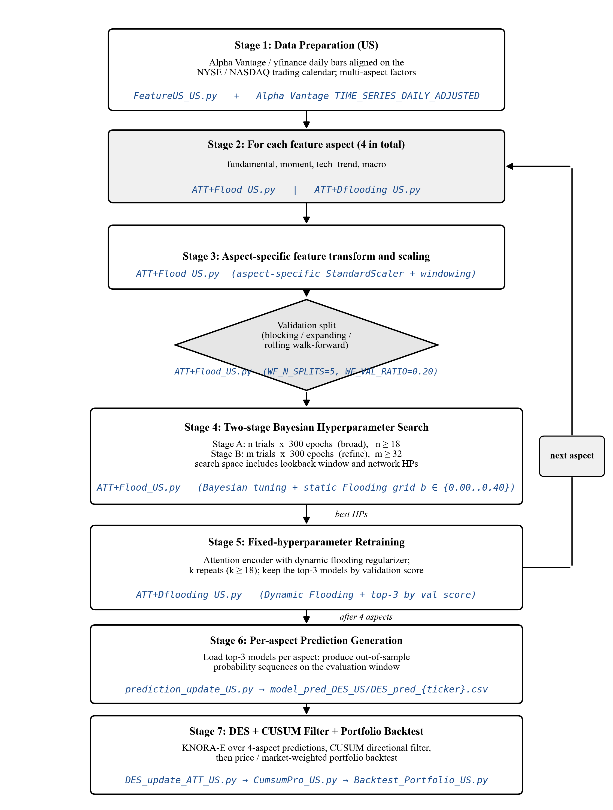

# DESQ — US Extension (Dow 30 / S&P 100 / NASDAQ 100)

Extension of the TW-50 pipeline in this repo to US equities. Same
**ATT + Dynamic Flooding + Dynamic Ensemble Selection (KNORA-E)**
methodology, adapted to US markets with a rolling walk-forward
validation window (train up to 2023-12-31, test 2024-01-02 → 2026-03-31).

The shipped portfolio backtests predate the revised paper's Double-DQN
execution layer. They retain the historical **DESQ** display label and `DES`
filenames, but are legacy DES+CUSUM diagnostics rather than reproductions of
the revised-paper US results.

## End-to-end training pipeline

The seven stages below are the complete per-stock workflow for the US
extension, annotated with the exact script in this repository that
implements each stage. The `next aspect` loop repeats stages 2–5 for each
of the four US feature aspects (`fundamental`, `moment`, `tech_trend`,
`macro`); after all four aspects are trained, stages 6–7 run once. Stage 7
additionally applies a CUSUM directional filter before the price /
market-weighted portfolio backtest.



Regenerate the figure with `python us/docs/_render_training_pipeline.py`.

## Layout

```
us/
├── AITree_US.py / AIScore_US.py          # Per-index score & tree visualisation
├── ATT+Flood_US.py                       # Bayesian hyper-param search (static flooding)
├── ATT+Dflooding_US.py                   # Retrain with Dynamic Flooding callback
├── DES_update_ATT_US.py                  # KNORA-E dynamic ensemble & DES predictions
├── CumsumPro_US.py                       # CUSUM-based signal filter
├── FeatureUS_US.py                       # Feature engineering (4 aspects)
├── Backtest_Portfolio_US.py              # Portfolio backtest engine (price/market-weighted)
├── run_us_daily_pipeline.py              # End-to-end daily inference driver
│
├── baselines/                            # 4-method × 3-universe legacy comparison
│   ├── combined/                         # Combined 1×3 chart + stats CSV/MD
│   ├── dsr_yang/                         # Yang 2018 IEEE — Dynamic Stock Recommendation
│   ├── mi_abbade/                        # Abbade & Costa 2026 — MACE (Almgren-Chriss)
│   └── summary_all_papers.md             # Full backtest summary
│
├── model_pred_DES_US/                    # DES per-ticker prediction CSVs (177 tickers)
├── cumSum_prob_12/                       # CUSUM filter tables (win=12)
├── selection/                            # Feature-aspect selection metadata
├── scalar/                               # Fitted feature scalers
├── evaluation/                           # Per-ticker evaluation metrics
├── model_output_US/                      # Per-ticker training curves (PNG)
├── backtest_portfolio_US/                # Portfolio backtest artefacts
└── .github/skills/                       # Copilot skills (pipeline docs)
```

## Legacy portfolio diagnostic — total return, 2024-01-02 → 2026-03-30

The revised paper reports DDQN returns of 67.4% (Dow 30), 82.8% (S&P 100),
and 83.5% (NASDAQ 100). Those values are `reported_only` because the matching
checkpoints and action paths are not shipped; see
[`../evaluation/paper/tables/table6_cross_market.csv`](../evaluation/paper/tables/table6_cross_market.csv).

| Method | Dow 30 | S&P 100 | NASDAQ 100 |
|---|---:|---:|---:|
| **DESQ (ours)**                            | **+68.62 %** | **+89.50 %** | **+92.06 %** |
| DSR — Yang 2018                           | +11.78 % | +64.45 % | +79.45 % |
| DRL Ensemble — Yang 2020                  | +28.57 % | +25.82 % | +51.60 % |
| MACE — Abbade & Costa 2026                | +65.53 % | +34.25 % | +40.96 % |
| Benchmark index                           | +19.89 % (^DJI) | +38.99 % (^OEX) | +38.74 % (^NDX) |

Full stats table (Sharpe, Sortino, MaxDD, Calmar): [baselines/combined/combined_stats.md](baselines/combined/combined_stats.md).

## Reproducibility

The `model_pred_DES_US/` predictions and `cumSum_prob_12/` filters
included here are sufficient to reproduce every plot and statistic under
`baselines/`. Model weights (~28 GB PyTorch checkpoints) and raw
feature matrices are **not** included — they can be regenerated from the
scripts using Alpha Vantage / yfinance data (Alpha Vantage key must be
placed in `.av_key` at the workspace root, never committed).

## Data windows

| Split | Range |
| --- | --- |
| Training | up to 2023-12-31 |
| Test / trade | 2024-01-02 → 2026-03-30 |
| Validation | rolling last 20 % of train (5 folds) |

## Feature aspects (4)

`fundamental`, `moment`, `tech_trend`, `macro`
(no `trade` aspect; US trade data via Alpha Vantage TIME_SERIES_DAILY_ADJUSTED).

## License

Inherits the repo-level `LICENSE`.
